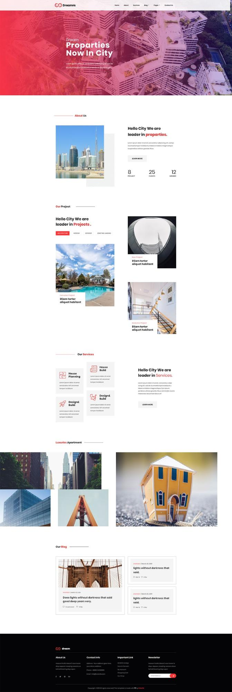
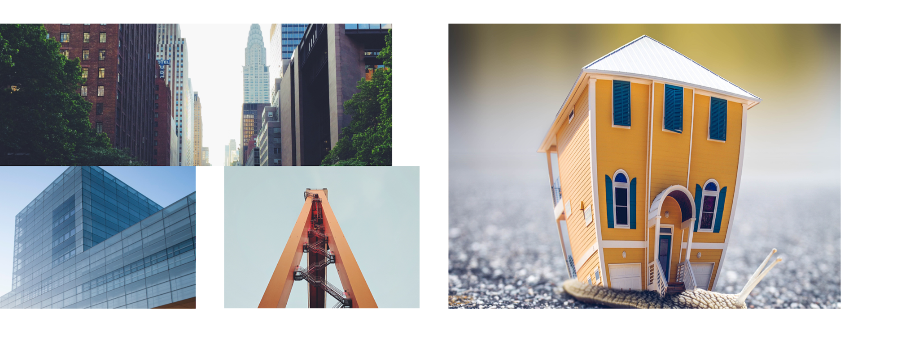

# Background

[https://colorlib.com/preview/#dreamrs](https://www.google.com/url?q=https://colorlib.com/preview/%23dreamrs&sa=D&ust=1561662223108000)

We are taking a pre-built HTML theme (Dreamrs) and turning it into a concrete5 template for learning purposes. There is no client, there is no architecture documentation, there is no designer we can push back on - so this process is a little odd. The goal with this document is to be deliberate about the choices that developers will make that might impact the content editors workflow.

The template uses functionality that is similar to what concrete5 ships with in the default “Elemental” theme. There is a blog in both. For the sake of time, that is not detailed here, but normally we would. The theme implies there some type of “property” or “project” page that describes real-estate listings. We will use the Portfolio page types for this as it feels like a similar architecture (again there’s no wireframes or SOW so we’re making things up here).

The home page contains most of the elements that are used elsewhere, so we’re just focusing on that. We’re assuming the content editors are not that web savvy and we’re erring on the side of being a little rigid with the blocks in the hopes that it keeps the design looking good over time. One could build this whole thing with layouts and blocks for atomic elements, but it would be easy for it to get sloppy over time. Instead were building custom blocks and page lists for horizontal stripes of content as much as possible.

* * *

# 

# Home

Top nav is built with auto-nav block and custom templates.

This header image is a custom block with Image attribute, Small Title, Big Title, short paragraph.

We deal with these subtitles in a block.

*   Which side is the line on (left/right)
*   What color is the line (red/black)
*   Which word is red[[a]](#cmnt1)?

Hello City “properties” section is a single block that serves the whole stripe. Fields include:

*   Image
*   Title 
*   Short paragraph
*   Link location (allow internal/external)
*   Link Label
*   # Projects
*   # Clients
*   # Members

Hello City “projects” is custom template for page list block. See below.

Hello City “services” is single block for whole stripe. See below 

Luxuries Apartment, custom template for the page list block.

Blog custom template for page list.

Footer: 4 global block areas for the columns. Hard code footer but make the year use current year php function.  
Social icons block on left, express form for emails on right.

* * *

## Projects custom template

*   This is a custom template for the page list block.
*   The hello city line is hard coded into the template.
*   The buttons come from a custom attribute (multi-select) that is added to the portfolio page type. Call it “Project_type”. If there are more than 4 unique project types added, just stack them up on new line.
*   The picture is the Thumbnail custom template.
*   The red line (new project/exclusive project) is a text field custom attribute so client can change it over time.
*   The ‘Etiam Tortor’ line is the page title.

* * *

## 

## Services Block

*   Single block for whole stripe.
*   Hard coded to always need 4 boxes.
*   Fields in block:

*   Title[[b]](#cmnt2)
*   Paragraph
*   Link (external/internal)
*   Link Label (defaults to Learn More)
*   Box NW

*   Image
*   Title
*   Text

*   Box NE

*   Image
*   Title
*   Text

*   Box SW

*   Image
*   Title
*   Text

*   Box SE

*   Image
*   Title
*   Text

* * *

## Luxury Apartment

*   Custom template for the portfolio section
*   This masonry component is a bit punky. We need to investigate how well it does with organic content. Right now its showing 1 wide, 2 small squares and 1 large square. Do we always have to serve it this, or will it gracefully handle a wider range of form factors?

[[a]](#cmnt_ref1)The longest word.

[[b]](#cmnt_ref2)OMG how do we deal with this red...
